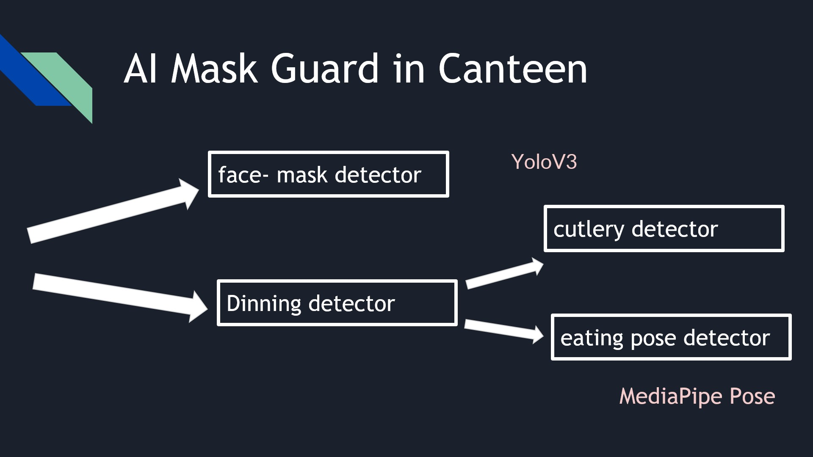
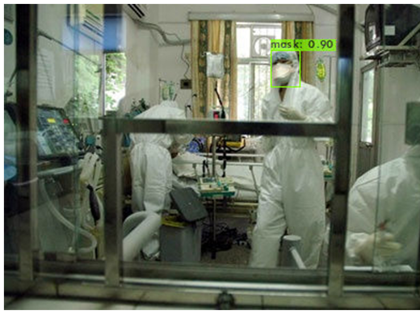
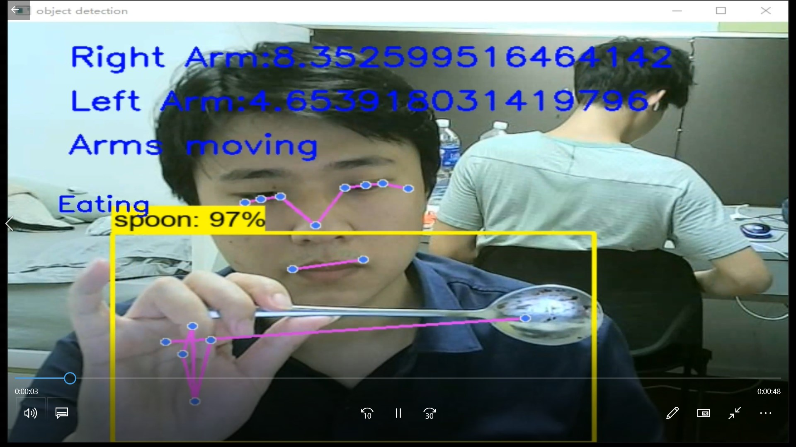
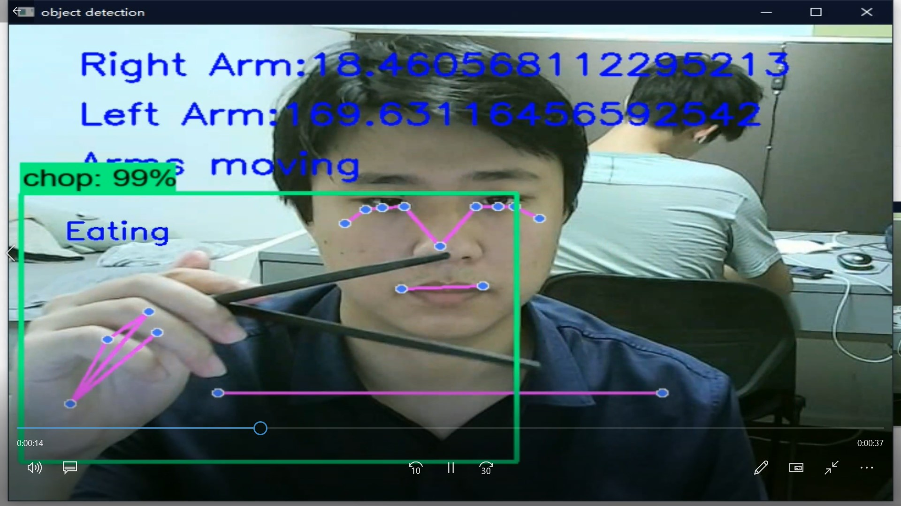
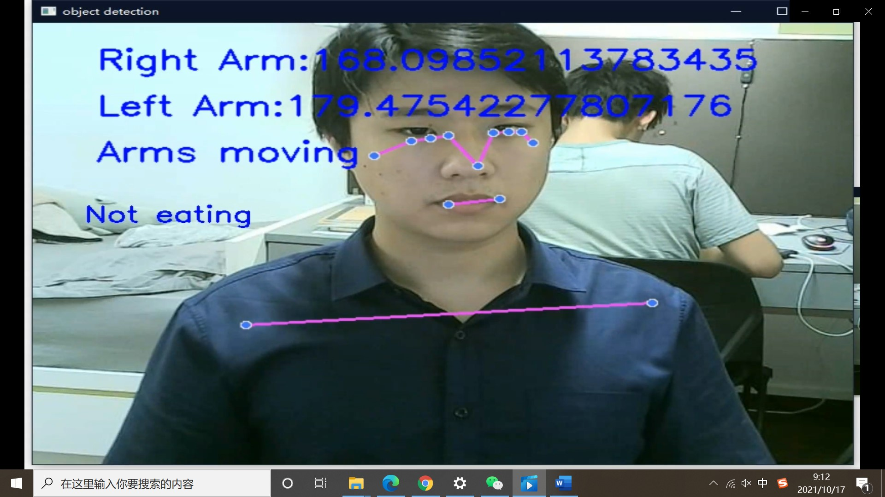

# 28_aNTiUlearn
## Inspiration
Nowadays, mask policy are important to stop the spread of COVID19 pandemic. In public places including the canteens, people may not wear their mask properly and put on their mask on time after they finish their meal. Therefore, this project aims for detecting such scenario automatically.

## What it does
Detecting whether a person is eating or not, and if the person is not eating and is not wearing a mask, the AI will detect it and send reminder.

## How we built it
We built it with mainly  CV components including Mask detection, hand held objects detection, and body pose detection. Combining these together, we return a final result of detection of whether the person is wearing a mask when he/she is not eating.

## Challenges we ran into
The accuracy of hand held objects detection was not originally high, and was improved later with a better data set.

## Accomplishments that we're proud of
We use multiple factors to detect the behavior of a person, including the object he is holding in his hand, whether his arm is moving and whether he is wearing a mask.

## What we learned
## What's next for AI Mask Guard in Canteen
The technique is not limited to circumstances including canteens, but can also serve scenarios including exam venues, where detecting possible cheating and talking is demanded, and so on.
## Basic Structure

## Demo Picture

## Real time interaction

